# 📘Práctica 1. Implantación de una web estática con Apache
!!! note "Objetivos"
    - Instalar y configurar un servidor web Apache2.
    - Crear distintos Host Virtuales en apache2 que nos permiten tener sitios web diferenciados.
    - Acceder a cada Host Virtual con un determinado nombre de dominio.   
## Instalación del servidor Apache2
Instalamos el servidor web Apache2 utilizando el gestor de paquetes `apt`.

- Ejecutando el siguiente comando 
    ```bash
        sudo apt install apache2
    ```
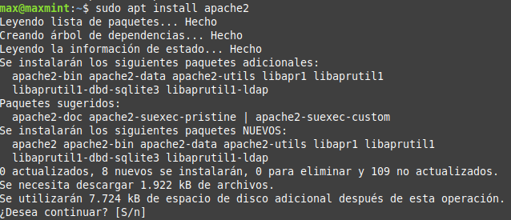

## Comprobación del estado de Apache
Verificamos que el servidor Apache esté activo y funcionando con `systemctl`.

- Ejecutando el siguiente comando 
    ```bash
        sudo systemctl status apache2
    ```
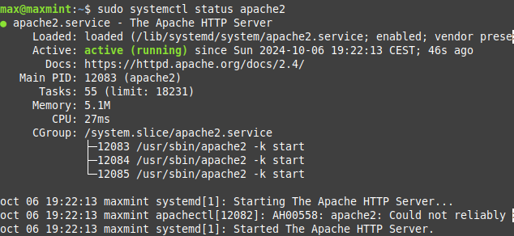

## Creación de directorios para los sitios web
Creamos los directorios donde estarán los archivos relacionados con la página web en el directorio `/var/www/html`

- Creamos los directorios con el comando `mkdir`
    ```bash
        sudo mkdir /var/www/html/web1
    ```
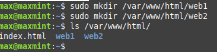

### Asignar permisos correctos
Asignamos los permisos necesarios para que el servidor Apache pueda acceder a ellos con `chown` cambiamos los permisos.
    ```bash
        sudo chmod -R 755 /var/www/html
    ```
    ```bash
        sudo chown -R USUARIO:USUARIO /var/www/html/web1
        sudo chown -R USUARIO:USUARIO /var/www/html/web2
    ```
    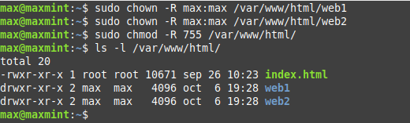

## Duplicar los archivos de configuración 
Vamos a copiar la configuración predeterminada de Apache para usarla como plantilla.
    ```bash
        sudo cp /etc/apache2/sites-available/000-default.conf /etc/apache2/sites-available/web1.conf
        sudo cp /etc/apache2/sites-available/000-default.conf /etc/apache2/sites-available/web2.conf
    ```
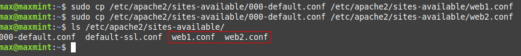

### Editar los archivos creados 
Vamos a modificar los archivos de configuración para que cada web apunten al directorio creado anteriormente
    ```bash
        sudo nano /etc/apache2/sites-available/web1.conf
        sudo nano /etc/apache2/sites-available/web2.conf
    ```

- Web 1
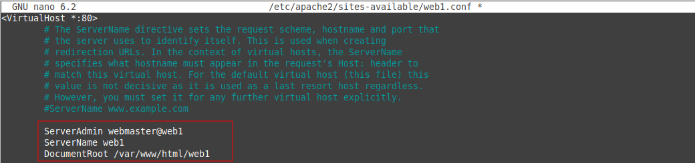

- Web 2
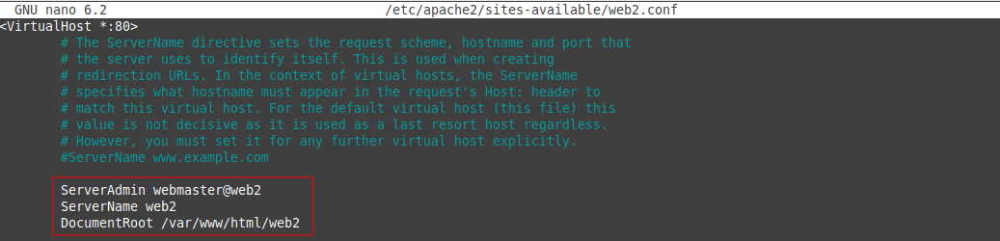

## Creamos los archivos HTML para que se visualicen en las Webs
Creamos los archivos `.html` para que el servidor los pueda interpretar

- Contenido de los archivos `HTML`
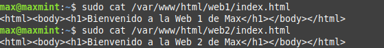

## Activación de los VirtualHost
Activamos los VirtualHost con el comando `a2ensite` sobre el archivo de configuración

- Activacion Web1
    ```bash
        sudo a2ensite web1.conf
    ```

- Activacion Web2
    ```bash
        sudo a2ensite web2.conf
    ```
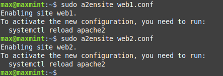

- Nos pide realizar un reinicio del servicio para que se apliquen los cambios, volvemos a usar el comando `systemctl`

     ```bash
        sudo systemctl reload apache2
    ```

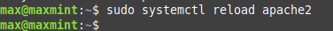

## Editar archivo hosts
Vamos a editar el archivo de `/etc/hosts/` para que nuestro propio equipo pueda resolver la web únicamente con el nombre de dominio
    ```bash
        sudo nano /etc/hosts
    ```
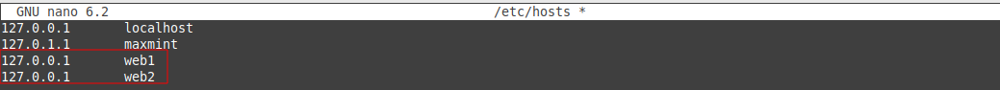

## Comprobación de las webs estáticas
- Accedemos a la url `http://web1`


- Accedemos a la url `http://web2`

