# 📘Práctica 2. Certificado SSL/TLS
!!! note "Objetivos"
    - Crear un certificado SSL/TLS autofirmado con la herramienta openssl.
    - Configurar el servidor web Apache para que utilice el certificado SSL/TLS autofirmado.
  
## Instalar OpenSSL
Es necessario realizar la instalación de `OpenSSL`para generar las claves y el certificado.
     ```bash
        sudo apt install openssl -y
     ```

## Crear un Certificado SSL Autofirmado
- Crear un directorio para almacenar el certificado
    ```bash
        sudo mkdir /etc/apache2/ssl
    ```
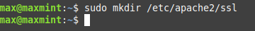

- Generar el certificado SSL y la clave privada:
    ```bash
        sudo openssl req -x509 -nodes -days 365 -newkey rsa:2048 -keyout /etc/apache2/ssl/firma.key -out /etc/apache2/ssl/firma.crt
    ```
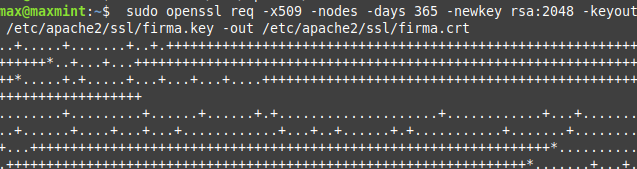
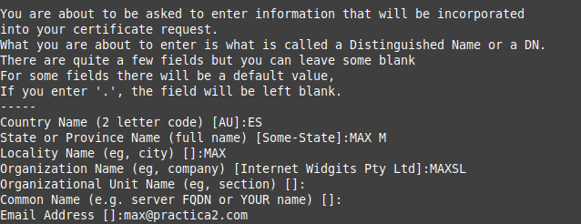

## Configurar Apache para usar SSL
- Habilitar los módulos SSL en Apache
    ```bash
        sudo a2enmod ssl
    ```

    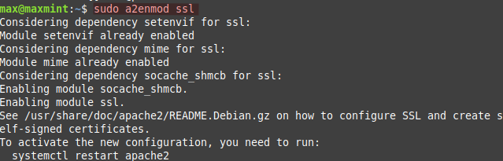

- Reinicio del servicio `Apache` y comprobación de su estado

    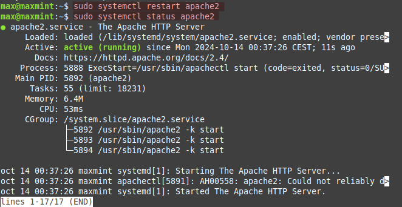

- Duplicamos el archivo de configuración de Apache
    ```bash
        sudo cp /etc/apache2/sites-available/000-default.conf /etc/apache2/sites-available/ssl.conf
    ```
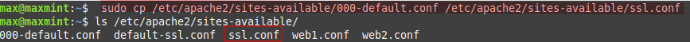
### Editar archivo configuración para SSL
- Editamos el archivo de configuración copiado anteriormente.
    ```bash
        sudo nano /etc/apache2/sites-available/ssl.conf
    ```

- Modificar el archivo de configuración
  
  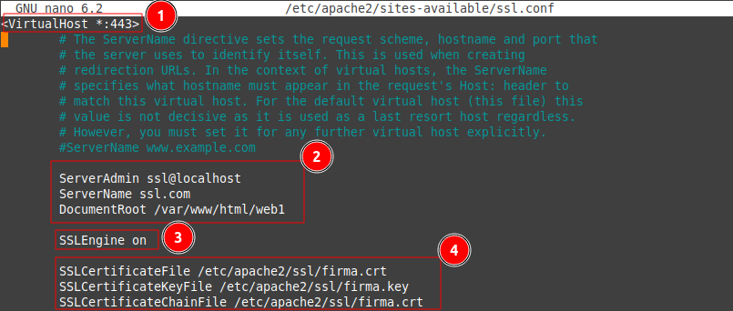

Cambiamos la configuración para que escuche en el puerto 443, añadir las directivas SSL y apuntamos a la web1 de la práctica anterior. 
### Habilitar el nuevo sitio SSL
- Habilitar el nuevo archivo de configuración
    ```bash
        sudo a2ensite ssl.conf
    ```
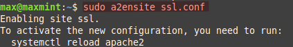

### Reiniciar servicio Apache2
Es necesario el reinicio del servicio para que los cambios se vean.
    ```bash
        sudo systemctl restart apache2
    ```


## Comprobación Web con SSL
Acceso por `https` con éxito

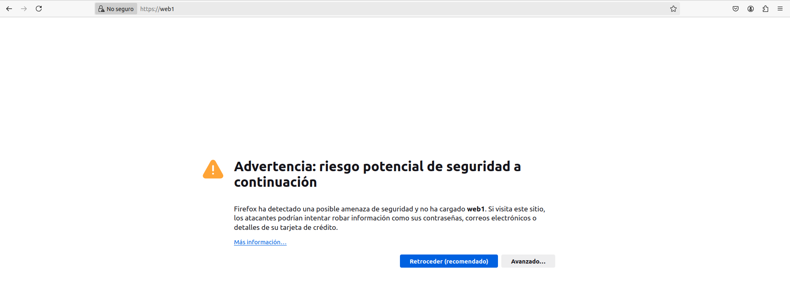
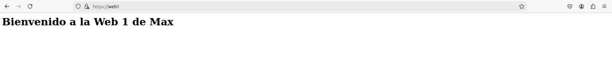

- Certificado SSL visualizado desde el navegador
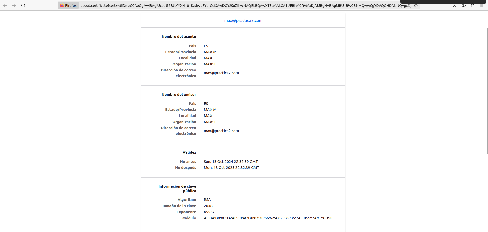