# 📘Práctica 3.Instalar, configurar y securizar phpMyAdmin
!!! note "Objetivos"
    - Instalar, asegurar y configurar phpMyAdmin en un servidor Ubuntu
    - Proteger PhpMyAdmin contra accesos no autorizados
    - Automatizar la instalación y configuración de phpMyAdmin mediante scripts de Bash

## Instalar PHP
Instalar PHP para que luego se pueda ejecutar bien el phpmyadmin:
     ```bash
        sudo apt install php libapache2-mod-php
     ```

## Instalación de phpMyAdmin
Abre tu terminal y ejecuta el siguiente comando para instalar phpMyAdmin
     ```bash
        sudo apt update
        sudo apt install phpmyadmin php-mbstring php-zip php-gd php-json php-curl
     ```

### Configurar phpMyAdmin para Apache
Durante la instalación se te pedirá que elijas el servidor web.

- Seleccionar `Apache`

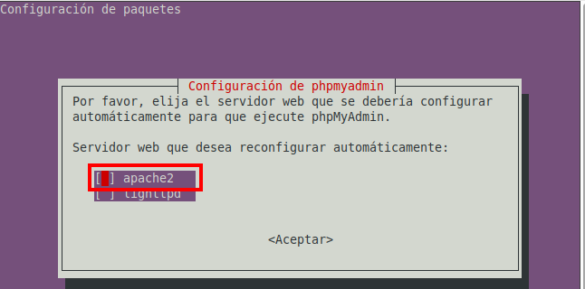

### Habilitar el archivo de configuración de phpMyAdmin
Ejecuta el siguiente comando para habilitar el archivo.
    ```bash
        sudo ln -s /etc/phpmyadmin/apache.conf /etc/apache2/conf-available/phpmyadmin.conf
        sudo a2enconf phpmyadmin
    ```

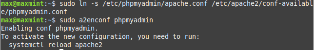

### Habilitar la extensión mbstring y reiniciar Apache
Ejecuta el comando para habilitar la extensión `mbstring`
    ```bash
        sudo phpenmod mbstring
    ```

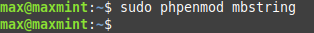

- Reiniciar el servicio `Apache`
    ```bash
        sudo systemctl restart apache2
    ```

### Configurar la base de datos para phpMyAdmin
Durante la instalación de phpMyAdmin,pedirá que configuremos una `base de datos` para `phpMyAdmin` con `dbconfig-common`
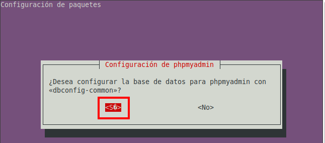

- Definimos la contraseña

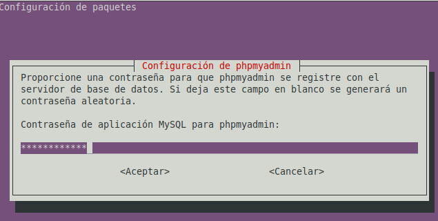

## Configuración del Acceso por Contraseña para la Cuenta Root de MySQL
Iniciar sesión en MySQL como root
    ```bash
        sudo mysql
    ```
Cambiar el método de autenticación a mysql_native_password:
    ```bash
        ALTER USER 'root'@'localhost' IDENTIFIED WITH mysql_native_password BY 'Root_1234';
        FLUSH PRIVILEGES;
    ```

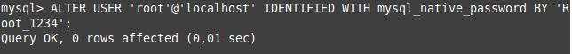

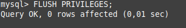

Otorgar privilegios a ROOT
    ```bash
        GRANT ALL PRIVILEGES ON *.* TO 'root'@'localhost' WITH GRANT OPTION;
        FLUSH PRIVILEGES;
    ```

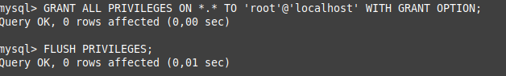


- Comprobar usuarios de MySQL

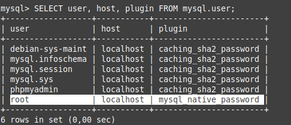

## Configuración del Acceso por Contraseña para un Usuario Dedicado de MySQL
- Crear un nuevo usuario con una contraseña segura:
    ```bash
        CREATE USER 'phpmyadmin_max'@'localhost' IDENTIFIED BY 'Root_1234';
    ```

- Otorgar privilegios al nuevo usuario
    ```bash
        GRANT ALL PRIVILEGES ON *.* TO 'phpmyadmin_max'@'localhost' WITH GRANT OPTION;
        FLUSH PRIVILEGES;
    ```
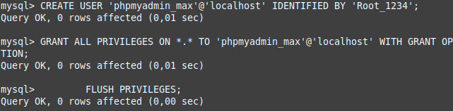

- Comprobar usuarios de MySQL
  
  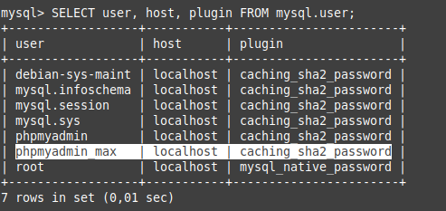

## Securizando Instancia de phpMyAdmin
Habilitar sobrescrituras de archivos `.htaccess` en `Apache`:

- Edita el archivo de configuración de `phpMyAdmin`:
     ```bash
        sudo nano /etc/apache2/conf-available/phpmyadmin.conf
     ```
Asegúrate de que la directiva `AllowOverride` está configurada en `All`

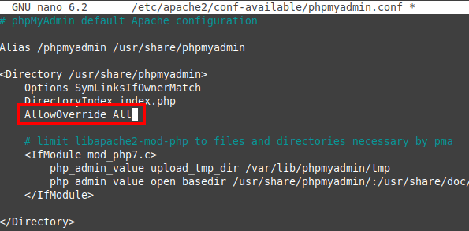

- Crear un archivo .htaccess en el directorio de phpMyAdmin:
     ```bash
        sudo nano /usr/share/phpmyadmin/.htaccess
     ```


- Agrega las siguientes líneas para habilitar la autenticación básica
  
     ```bash
        AuthType Basic
        AuthName "Acceso Restringido"
        AuthUserFile /etc/phpmyadmin/.htpasswd
        Require valid-user
     ```

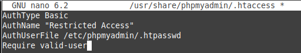

- Crear un archivo .htpasswd para almacenar las credenciales
     ```bash
        sudo htpasswd -c /etc/phpmyadmin/.htpasswd phpmyadmin_max
     ```
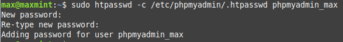

## Comprobaciones
- Acceso a http://IP/phpmyadmin
  
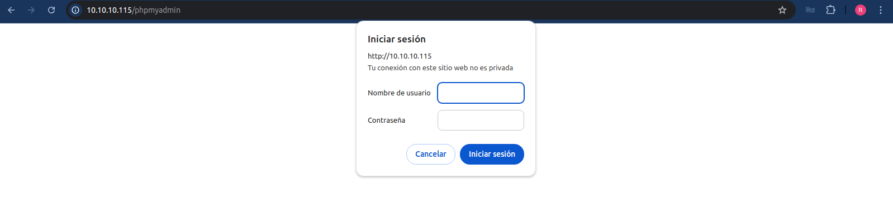

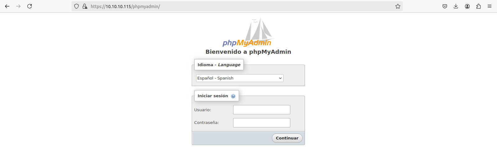